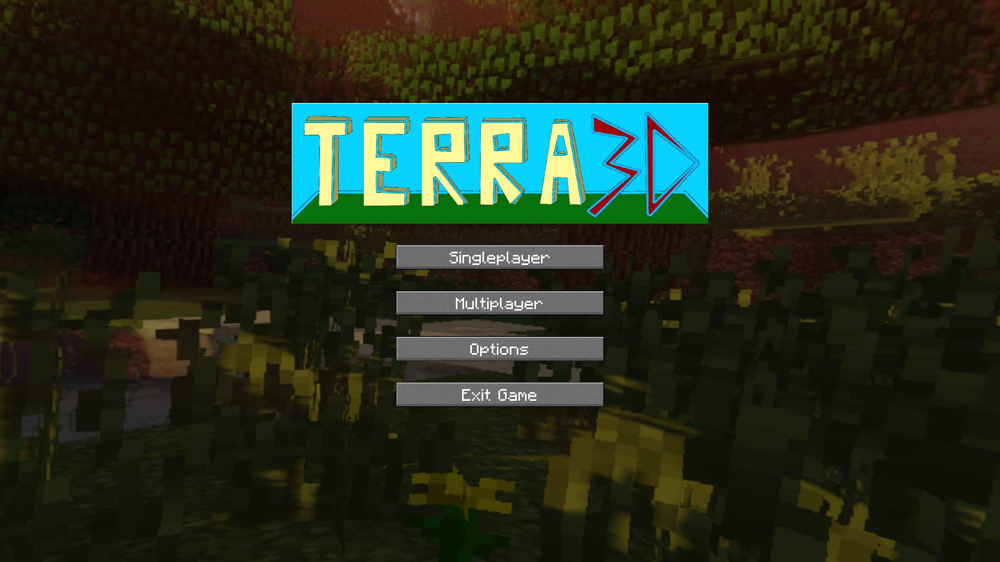
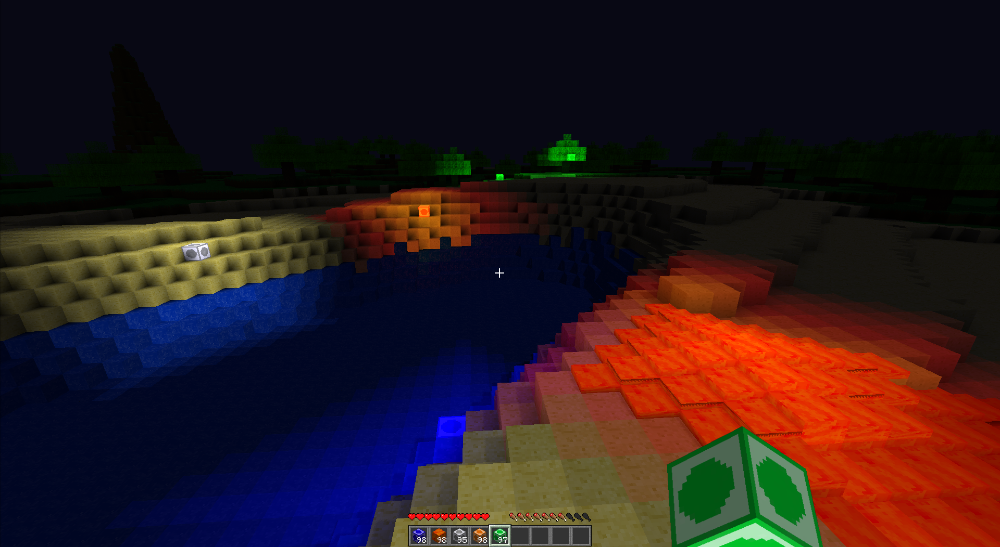
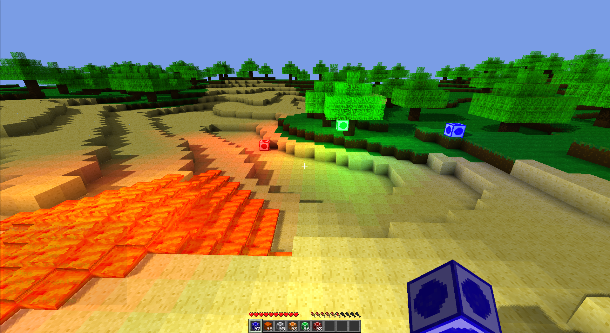
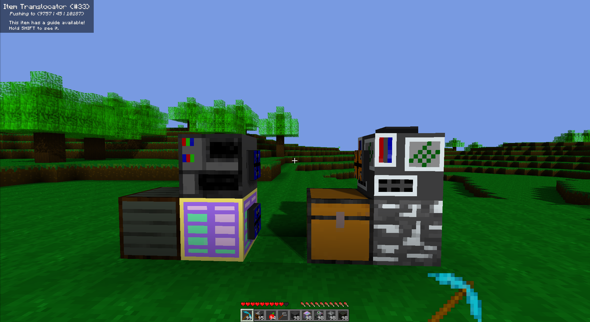

# Terra3D

A procedually generated 3D voxel game made as a school project, inspired by Minecraft.

## Features

- Fully multiplayer
- Lighting system with colored light, shadows and AO
- Chat and player command processor
- Support for texture packs, including Minecraft ones
- Energy generation/transfer system including various machines
- Fluid mechanics (water/lava)
- On-the-fly localization support (English and German)
- Dynamically loaded items, block and world generation parameters

## Demo






### Build

You will need to extract some files from a Minecraft 32x32 texture pack, as well as a sound pack,
in addition to providing some other files. 
Put them into /assets/resourcepacks/default, so that your directory structure should look like this:

```bash
assets/resourcepacks/default/
├── font # Fonts used throughout the game
│   ├── italic.ttf
│   ├── monospace.ttf
│   └── regular.ttf
├── models
│   ├── skybox.mtl # In-menu skybox
│   ├── skybox.obj
│   └── sky_box.png
├── pack.yaml # Provided
├── sounds # Minecraft sound pack
│   ├── ambient
│   ├── block
│   ├── damage
│   ├── dig
│   ├── entity
│   ├── fire
│   ├── item
│   ├── liquid
│   ├── mob
│   ├── music
│   ├── random
│   └── step
└── textures # Minecraft texture pack
    ├── blocks
    ├── gui
    ├── items
    ├── moon.png # In-game moon
    └── sun.png # In-game sun
```

To then build:

``` bash
# Run on desktop
./gradlew desktop:run
# Run standalone server
./gradlew server:run

# Create jarfiles in build/libs
./gradlew desktop:dist 
./gradle server:dist
```